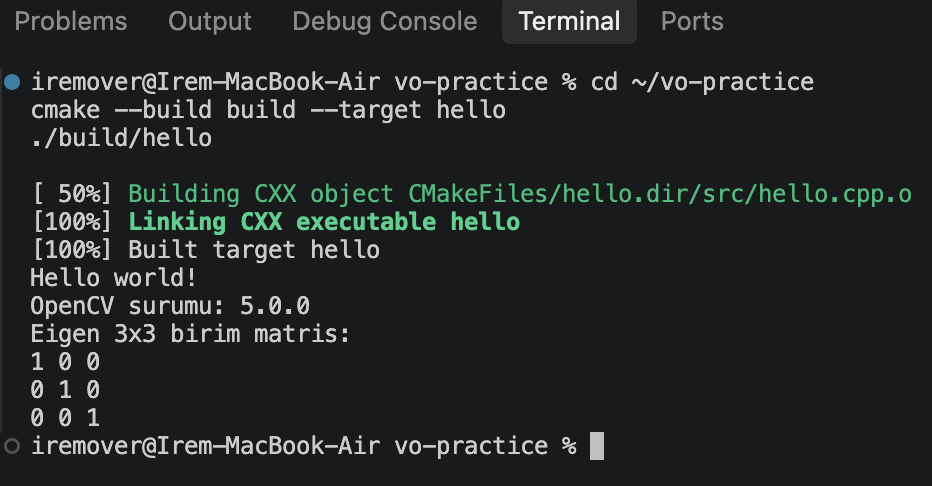
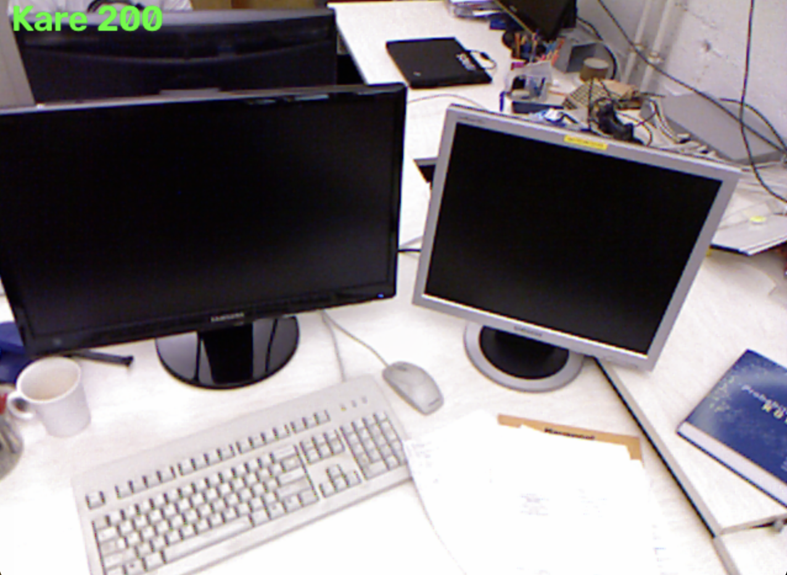
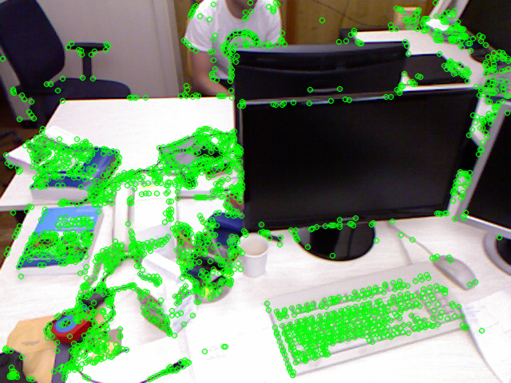
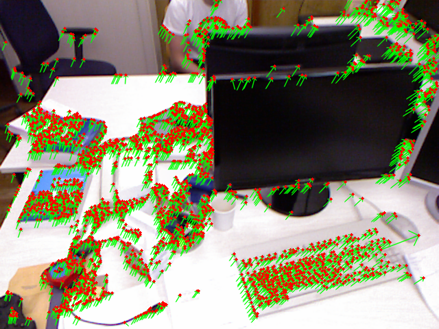

# vo-practice: CMake + OpenCV + Eigen ile Görsel Odometri Ön Çalışması

Mezuniyet projem için yaptığım ön pratik çalışması. C++ ile CMake, OpenCV ve Eigen kullanarak bir görüntü dizisi üzerinde FAST köşe tespiti ve KLT nokta takibi uyguladım ve her aşamanın süresini ölçtüm.

## Gereksinimler (macOS)

```bash
xcode-select --install
brew install cmake opencv eigen
```

## Derleme

```bash
cmake -S . -B build
cmake --build build
```

## Veri Seti

[TUM RGB-D](https://cvg.cit.tum.de/data/datasets/rgbd-dataset) `freiburg1_xyz` dizisi kullanıldı. Boyutu büyük olduğu için repoya eklenmedi. İndirip `data/rgb/` klasörüne açılmalıdır.

## Görevler ve Çıktılar

### 1. Derleme (CMake + OpenCV + Eigen)

```bash
./build/hello
```



### 2. Görüntü dizisini kare kare okuma

```bash
./build/show_sequence data/rgb
```



### 3. FAST köşe tespiti

```bash
./build/fast_corners data/rgb/1305031102.175304.png
```



### 4. KLT ile nokta takibi

```bash
./build/klt_tracking data/rgb/1305031102.175304.png data/rgb/1305031102.243211.png
```



### 5. Süre ölçümü

```bash
./build/benchmark data/rgb
```

**Test bilgisayarı:** MacBook Air (M5), 24 GB RAM, macOS
**Derleme modu:** Release
**Veri seti:** TUM RGB-D freiburg1_xyz, ilk 200 kare (199 kare çifti)

| Aşama | Ortalama süre (ms) |
|---|---|
| Görüntü okuma | 2.802 |
| FAST | 0.453 |
| KLT | 1.547 |
| Çizim | 0.219 |
| **Toplam / kare** | **5.021** |

Toplam yaklaşık 5 ms/kare, yani teorik olarak saniyede 200 kare işlenebiliyor. En çok zaman alan aşama görüntü okuma oldu: PNG dosyalarını diskten okuyup açmak, FAST ve KLT hesaplamalarından bile daha uzun sürdü.
